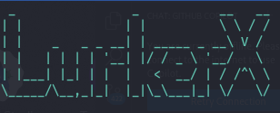

  
  
  

  
  
  
  
  

  
  
  
  

### Developers willing to get the passphrase to unlock source code zip should obtain it using THIS LINK.

### What led to the development of this project?
  1. Curiosity and the act of challenging computer security.
  2. For efficient and sandboxed usage. (CTFs, research and forensics, etc.)
  3. Make it open-source for programmers to share and expand their knowledge

## Guides

**Disclaimer:**

It is crucial to emphasize that LurkerX is intended for ethical and educational purposes only. Any misuse of this project for malicious activities is strictly prohibited and could have legal consequences. The developers of LurkerX do not condone or encourage any illegal or unethical use of this software.

**Features:**

* **Location Tracking:** LurkerX can track the precise geolocation of the target device, providing detailed information about the user's movements.
* **SMS and Call Log Monitoring:** LurkerX can intercept and record all incoming and outgoing SMS messages and call logs, providing insights into the user's communication patterns.
* **Data Exfiltration:** LurkerX can exfiltrate sensitive data from the target device, including contacts, photos, and other personal information.
* **Stealthy Operation:** LurkerX is designed to operate stealthily, evading detection by antivirus and security software.
* **Backdoor:** LurkerX allows advanced users to create custom commands in Shell Script for additional functionality and data collection.
    

      
      
    

**Ethical Usage:**

LurkerX can be used for various ethical research purposes, such as:

* **Understanding Spyware Behavior:** Researchers can use LurkerX to analyze the behavior of spyware applications and develop countermeasures.
* **Security Training and Awareness:** Security professionals can use LurkerX to simulate real-world spyware attacks and educate users about the dangers of such threats.
* **Malware Analysis and Detection:** Researchers can use LurkerX to develop and test malware detection and analysis tools.

**Community and Collaboration:**

LurkerX is an open-source project, encouraging collaboration and contributions from the security research community. Developers are welcome to contribute code, report bugs, and share their findings.

**Disclaimer:**

Once again, it is crucial to emphasize that LurkerX is intended for ethical and educational purposes only. Any misuse of this project for malicious activities is strictly prohibited and could have legal consequences. The developers of LurkerX do not condone or encourage any illegal or unethical use of this software.

**By using LurkerX, you agree to these terms and conditions.**
